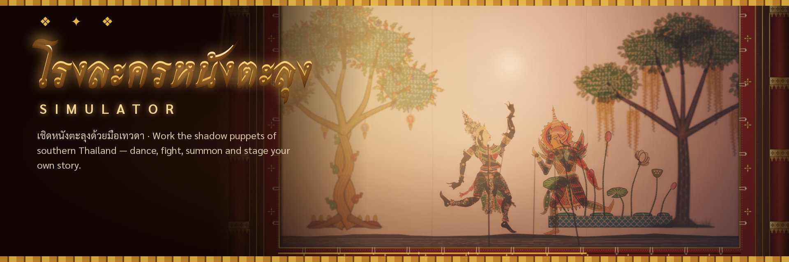

# โรงละครหนังตะลุง Simulator



A browser sandbox of southern Thai shadow-puppet theatre. You are a deva in a
golden heaven above a village show; golden strings run from your โขน dancer's
hand down to leather puppets behind a lamp-lit cloth.

## Run

Any static server works (ES modules, no build step). Camera tracking needs
`localhost` or https.

```
npx serve .        # or: python3 -m http.server
# open http://localhost:3000   (?intro=0 skips the intro)
```

## Play highlights

- Drag puppets, pose any limb by hand, throw them; pinch-zoom and pan on phones.
- ท่ารำ dances, greetings (handshake, ไหว้, hug), fights with a vital-aim combat AI, souls, wounds and magic.
- A living audience of puppet devas below the stage — scroll down (wheel, drag, or the ผู้ชม medallion) to watch them cheer, boo and go wild in fights.
- Ready-made scenes, swaying trees, animals with AI (หมูเด้ง!), ช้างเอราวัณ, ตะกร้อ / ping-pong / jump rope, grid build mode, a timeline editor and a guide deva, น้องเมฆ.
- `?unlock=all` opens every quest-sealed drawer; `?intro=0` skips the menu.

## What's inside

- **Shadow screen** (`js/render/screen.js`): every puppet/prop is projected
  from the lamp by depth (`1/(1-z)`), with a penumbra that grows with distance,
  colour only when pressed on the cloth, multiplicative transmission through
  dyed and perforated hide, a membrane-simulated cloth that ripples, bulges and
  flickers with the oil lamp.
- **Physics** (`js/physics/world.js`, `js/puppet/puppet.js`): XPBD rigid bodies,
  one per limb, jointed with limits and soft pose drives; main rod + dangling
  hand rods; held weapons; collisions only between puppets at similar depth.
- **Moves** (`js/puppet/animations.js`): strike, lunge, block, Thai dance,
  ตั้งวง, wai, leap, demon roar, laugh, bow… blended with physics.
- **Hand tracking** (`js/tracking/`): MediaPipe hands; palm = body, hand size =
  depth, tilt = lean, flip hand = turn, each finger a limb, poses trigger moves,
  two hands = two puppets. "Hand demo" shows it without a camera.
- **Sandbox**: puppet house with ~18 puppets and ~110 props, little เทวดา stagehands with
  roles (fighter, dancer, merchant, villager, comedian, monster, coward,
  follower, wanderer), procedural Thai music and sound (`js/audio/`).
- **Art**: everything is drawn in code as cut leather (`js/art/leather.js`,
  see `docs/ART_GUIDE.md`); the hermit and princess recreate the uploaded part
  sheets (`js/puppet/characters/sheetPuppets.js`). Scenery is painted as
  layered handmade paper.

Controls: press **H** in game.

## Tools

- `tools/preview.html?m=js/props/food.js` — art preview (back-lit / front-lit)
- `tools/physics-test.html`, `tools/audio-test.html`, `tools/hands-test.html`
- `node tools/test-gestures.mjs` — gesture classifier tests
- `node tools/shot.mjs "<page>" out.png` — headless screenshots
